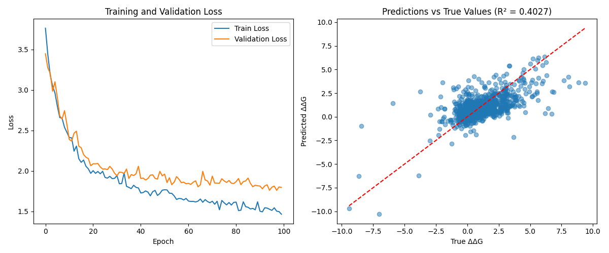

DDG prediction
**Structure-aware prediction of mutational effects in SKEMPI 2.0 database using deep learning




## Requirments
This project runs on Python 3.10.


## Usage

### Making predictions

Example command:
```
python ddg_predict.py --pdb 1ACB --mutation L38G --model ddg_predictor_model.pth --chain I --wt_af 0.00000000000149 --mt_af 0.0000000455
```
### Tuning ESM model

```
python esm_fine_tune.py
```
### Training your own model
You will get a model file "ddg_predictor_model_new.pth", and a scaler file "ddg_scaler_new.pkl"
```
python ddg_train.py
```

## Changelog
3/5 - Minor improvements  
2/5 Added script for tuning ESM model, predicting using saved model  
1/5 - Added ability to save model, minor fixes.  
27/4 - Added struture awareness  
26/4 - Initial commit, prediction only from facebook ESM embeddings  

